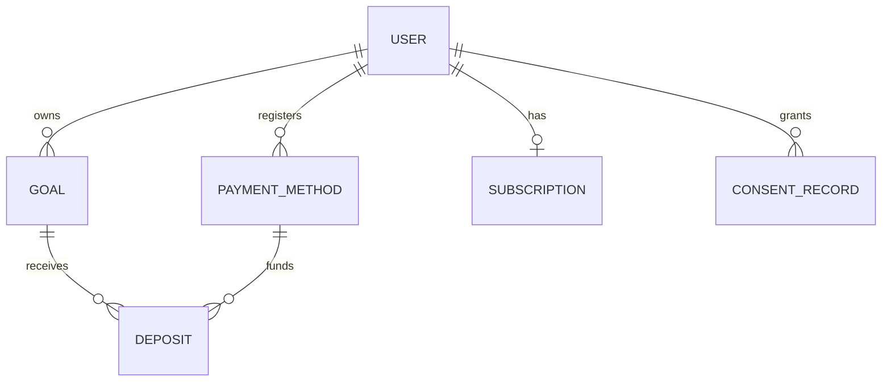

# Data Model: [Product Name]

> **Verdict**: [MODEL READY | NEEDS REVISION | NOT ASSESSED]
> **Status**: Draft | In Review | Approved
> **Owner**: [tech-lead or named person] — reviewed with `data-specialist`
> **Last Updated**: [YYYY-MM-DD]
> **Primary Store**: [PostgreSQL 16 — ADR-NNNN: title] (from `stack.layers.data.database`)
> **Other Stores**: [Redis 7 (cache, rate limits, locks) · object storage (receipts) · warehouse (analytics) | none]
> **ORM / Migration Tool**: [Prisma 6 / Prisma Migrate | TypeORM | Drizzle Kit | JPA + Flyway | SQLAlchemy + Alembic | Django migrations] — files in `stack.layers.data.migrations_dir` = [`apps/api/prisma/migrations`]
> **Naming**: tables `naming.db_tables` = [`snake_case` plural] · columns `naming.db_columns` = [`snake_case`]
> **Security Engineer Review (SE-SECURITY-REVIEW)**: [APPROVED YYYY-MM-DD | CONCERNS (accepted) YYYY-MM-DD | REVISED YYYY-MM-DD | pending — REJECT findings unresolved YYYY-MM-DD | [SE-SECURITY-REVIEW] skipped — <Mode> mode]

<!--
Template: .claude/docs/templates/data-model.md, written to docs/data/data-model.md by /data-model (model mode).
The nine `##` headings are a contract (gate-validation checks the classification and the migration strategy;
/api-design, /create-epics, /story-done and /security-audit read the sections by name). Keep them in English as
spelled; write the body in the team's language. Replace every [bracketed] placeholder; delete "Example (Moa)"
rows once real rows exist. Numbers that come from a law or a vendor carry "(Source: <url>, retrieved YYYY-MM-DD)".
-->

## Entities

One row per entity (a table, collection or document type), then one field table per entity. Entity names match
the glossary in `design/registry/entities.yaml`; table and column names follow `naming.db_tables` /
`naming.db_columns`.

| Entity | Table | Description | Owning module | Source PRD | TR-IDs |
|---|---|---|---|---|---|
| [entity] | [table] | [one line] | [module/service] | `design/prd/[feature].md` | [TR-feature-NNN] |
| Example (Moa): goal | `goals` | A user's savings goal with target amount and date | goals | `design/prd/goals.md` | TR-goals-001, TR-goals-002 |

### [entity]

| Field | Type | Null | Default | Constraints | Classification | Notes |
|---|---|---|---|---|---|---|
| `id` | [text (prefixed ULID) / uuid / bigint] | no | generated | PK | Internal | never used as an authorization check |
| `[field]` | [type] | [yes/no] | [default] | [unique / check / FK] | [Public / Internal / Confidential / PII / Sensitive-PII] | [meaning, unit] |
| `created_at` | timestamptz | no | `now()` | | Internal | UTC |
| `updated_at` | timestamptz | no | `now()` | | Internal | UTC; drives `ETag` / sync |

Example (Moa) — `goals`:

| Field | Type | Null | Default | Constraints | Classification | Notes |
|---|---|---|---|---|---|---|
| `id` | text | no | generated | PK, `goal_` + ULID | Internal | |
| `user_id` | text | no | | FK → `users.id`, indexed | Internal | owner; every query filters on it |
| `name` | varchar(40) | no | | length 1–40 | PII | free text may contain personal information |
| `target_amount` | bigint | no | | `> 0` | PII | KRW, integer won (no minor unit) |
| `saved_amount` | bigint | no | `0` | `>= 0` | PII | derived from confirmed deposits; written only by the deposit flow |
| `currency` | char(3) | no | `'KRW'` | ISO 4217 | Internal | |
| `target_date` | date | yes | | | PII | Asia/Seoul calendar date |
| `status` | text | no | `'active'` | in (`active`, `paused`, `completed`, `archived`) | Internal | |
| `version` | integer | no | `1` | | Internal | optimistic locking |

## Relationships

| Relationship | Cardinality | Enforced by | Delete behaviour |
|---|---|---|---|
| [parent] → [child] | [1 : N] | [FK within the module / ID reference across modules] | [cascade / restrict / soft delete / set null] |
| Example (Moa): user → goals | 1 : N | FK `goals.user_id` | account erasure deletes goals (see `## Retention & Deletion`) |
| Example (Moa): payment method → deposits | 1 : N | ID reference (payments module owns deposits) | restrict — history is kept for the legal retention period |

References that cross a module or service boundary are IDs without a foreign key, so the modules can be split
later; say so in the table.

## Ownership

Every entity has **one** owning module or service — the only writer. Other modules read through the owner's API
or events, never by writing its tables. This section is synced to `docs/registry/architecture.yaml`
(`data_ownership`).

| Entity | Owner (module / service) | Writes | Reads (and how) | Events published | Registry entry |
|---|---|---|---|---|---|
| [entity] | [module] | [owner only] | [module — API / event / read replica] | [event names from the tracking plan or domain events] | [synced YYYY-MM-DD / pending] |
| Example (Moa): goal | goals | goals | notifications (event `goal.completed`), admin-console (API) | `goal.created`, `goal.completed` | synced |
| Example (Moa): deposit | payments | payments | goals (event `deposit.confirmed` updates `saved_amount`) | `deposit.confirmed`, `deposit.failed` | synced |

## Data Classification

| Class | Meaning | Examples (Moa) | Handling |
|---|---|---|---|
| Public | may be published | plan names and prices | no restriction |
| Internal | operational data with no personal meaning on its own | opaque IDs, status enums, system timestamps | least-privilege access |
| Confidential | business-sensitive, not about a person | PG merchant settings, revenue figures, fraud rules | restricted roles, audit log |
| PII | identifies or relates to an identifiable person | email, phone, name, social-login subject IDs, device tokens, user-entered text, a user's goals and balances | minimise; retention and erasure path; excluded from logs, analytics events and error reports |
| Sensitive-PII | special categories and unique identifiers, and data whose leak causes direct financial harm (KR: 민감정보, 고유식별정보) | identity-verification CI/DI, national ID numbers (collect only where a law requires it), bank account and card numbers, precise location, health data | Personal-information rules plus field-level encryption or tokenisation (store the PG billing key, not the account number), separate access role, explicit legal basis |

**PII inventory** — every field classified `PII` or `Sensitive-PII` has a row, and every row has a retention rule
and a deletion path (gate-validation checks this when `privacy.handles_pii: true`).

| Entity.field | Class | Purpose | Legal basis / consent | Retention | Deletion path | Protection | In logs / analytics |
|---|---|---|---|---|---|---|---|
| [entity.field] | [PII / Sensitive-PII] | [why collected] | [contract / consent type / legal obligation] | [period + trigger] | [erasure job / anonymisation] | [encryption / tokenisation / masking] | never |
| Example (Moa): users.email | PII | sign-in, receipts | contract | while the account exists | account erasure job | at-rest encryption (volume) | never (hashed user ID only) |
| Example (Moa): payment_methods.billing_key | Sensitive-PII | auto-debit via Toss Payments | contract | until removed or account erased | delete locally + revoke at the PG | field-level encryption, payments role only | never |

## Retention & Deletion

| Data set | Retention | Trigger | Deletion method | Exception / legal hold (with source) |
|---|---|---|---|---|
| [data set] | [period] | [account deletion / inactivity / end of purpose] | [hard delete / anonymise / archive] | [law and article (Source: <url>, retrieved YYYY-MM-DD) or "none"] |
| Example (Moa): goals | while the account exists | account deletion | hard delete by the erasure job | none |
| Example (Moa): deposit and payment records | [period required by commerce and electronic-financial-transaction law] | account deletion | move to a restricted archive, anonymise after the period | [law (Source: <url>, retrieved YYYY-MM-DD)] |

**Account erasure path** — the steps that run when a user deletes the account: [grace period] → revoke sessions
and push tokens → delete or anonymise each PII field in the inventory → request deletion at processors (payment
gateway, messaging provider, analytics) → backups age out within [backup retention] → an audit record without
personal data.

**Consent linkage** — consent records (`consent_type`, `version`, `channel`, `granted_at`, `withdrawn_at`) and the
fields or processing that depend on each consent. Marketing consent is separate from terms acceptance; for `kr`,
advertising messages need prior opt-in and separate consent for night-time sending — see
`.claude/docs/compliance/kr.md` `## Marketing Messages & Consent`. Withdrawal stops the dependent processing
within [period].

## Indexes & Access Patterns

Every index serves a named access pattern; every access pattern names the operation or job that runs it.

| # | Access pattern | Caller (operation / job) | Query shape | Index | Expected rows / rate | Evidence |
|---|---|---|---|---|---|---|
| AP1 | [pattern] | [`operationId` / job name] | [WHERE … ORDER BY … LIMIT …] | [table (columns)] | [rows, QPS] | [EXPLAIN plan, date / pending] |
| Example (Moa): AP1 | a user's goals by status, newest first | `listGoals` | `WHERE user_id = $1 AND status = $2 ORDER BY created_at DESC, id DESC LIMIT 21` | `goals (user_id, status, created_at DESC, id DESC)` | ≤ 20 goals per user | pending |
| Example (Moa): AP2 | debits due today | job `auto-debit-scheduler` | `WHERE next_debit_date = $1 AND status = 'active'` | partial index on `subscriptions (next_debit_date) WHERE status = 'active'` | peak on the 25th | pending |

Cursor pagination needs an index whose trailing columns are the sort key plus the unique tiebreaker. Composite
index order: equality columns, then range, then sort.

## Multi-tenancy

- **Model**: [single-tenant per user (B2C — ownership by `user_id`) | shared schema with `tenant_id` on every
  table + PostgreSQL row-level security | schema per tenant | database per tenant].
- **Isolation enforcement**: [every query filters by the owner key through the repository layer / RLS policies
  keyed on a session variable] — tests prove one owner cannot read another's rows.
- **Background jobs and admin tools** run with an explicit owner or tenant scope; cross-tenant access (support,
  admin console) is role-gated and audit-logged.
- Example (Moa): B2C, single-tenant per user; every table carrying user data has `user_id`; the admin console reads
  through support operations that write an audit record.

## Consistency & Transactions

| Operation | Tables touched | Transaction boundary | Isolation | Invariant | Concurrency control |
|---|---|---|---|---|---|
| [operation] | [tables] | [single local transaction / saga] | [READ COMMITTED / REPEATABLE READ / SERIALIZABLE] | [rule that must hold] | [unique constraint / `SELECT … FOR UPDATE` / optimistic `version`] |
| Example (Moa): confirm deposit | `deposits`, `goals`, `outbox` | one local transaction | READ COMMITTED | `saved_amount` = sum of confirmed deposits | unique `(pg_payment_key)`; `goals.version` check |

- External calls (payment gateway, identity verification, messaging) never run inside a database transaction;
  multi-step flows are sagas with compensations and a recorded state per step.
- Events leave through a transactional outbox (row written in the same transaction, relayed by the worker); the
  event publisher and consumers are idempotent on the event ID.
- Idempotency keys (see `docs/api/api-guidelines.md` `## Idempotency Keys`) are stored with a unique constraint.
- Reads from replicas are allowed only where stale data is acceptable; read-your-writes paths use the primary.

## Migration Strategy

- **Tool and layout**: [tool] in `stack.layers.data.migrations_dir` ([path]); one migration per logical change; file
  names per the tool ([timestamped directory / `V<n>__<desc>.sql` / revision ID]); every migration file names its
  plan in a header comment (`-- Plan: docs/data/migrations/NNNN-<slug>.md`).
- **Expand → Migrate → Contract** for every change that is not purely additive: Expand is additive only; Migrate
  dual-writes and backfills in batches with verification queries; Contract removes old columns, tables or code
  paths only after every reader is deployed — for mobile, after the minimum supported app version no longer
  reads them. Never drop or rename in the release that stops using a column.
- **Online DDL rules for [store]**: [PostgreSQL — `CREATE INDEX CONCURRENTLY`; add constraints `NOT VALID` then
  `VALIDATE CONSTRAINT`; add columns nullable or with a constant default; `SET lock_timeout` on every DDL
  migration | MySQL 8 — `ALGORITHM=INSTANT` or `INPLACE` where supported, an online schema-change tool for large
  tables].
- **Default budgets**: lock wait ≤ [2 s] (`lock_timeout`), statement ≤ [n s] outside backfills; backfill batches of
  [1,000–10,000] rows with a pause between batches; anything above budget needs a plan note and a window.
- **Deploy ordering**: migrations run in the deploy pipeline before the application version that needs them;
  never by hand against a shared database.
- **Plans**: every non-additive change has a plan in `docs/data/migrations/NNNN-<slug>.md`
  (from `.claude/docs/templates/migration-plan.md`).

| Plan | Change | Expand | Migrate | Contract | Verdict |
|---|---|---|---|---|---|
| [`docs/data/migrations/NNNN-slug.md`] | [one line] | [pending / applied-staging / applied-production] | [status] | [status + scheduled release] | [SAFE / RISKY — MITIGATION REQUIRED / UNSAFE / NOT ASSESSED] |

**Migration floor**: a story whose `**Migration**` is not `None` (any Type) requires
`production/qa/evidence/<story-slug>/migration-dry-run.log` — Expand applied and rolled back on a disposable
database — at every `qa.level` and regardless of `testing.strict.config`; absent ⇒ BLOCKING.
