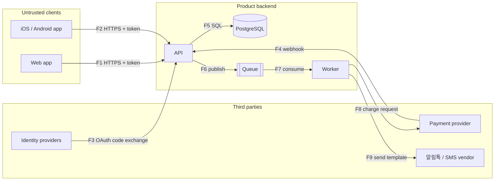

# Threat Model: [Product Name]

> **Owner**: [role — usually security-engineer, with technical-director accepting residual risk]
> **Last Updated**: [YYYY-MM-DD]
> **Scope**: [system or release covered — e.g. "Moa MVP: web, iOS, Android, public API, admin console, worker"]
> **Inputs**: [paths read — `docs/architecture/architecture.md`, `docs/data/data-model.md`, `docs/api/openapi.yaml`, ADRs by number; or "none — built from interview"]
> **Regions**: [value of `compliance.regions` — e.g. `kr`; `none` when explicitly none; "unset — asked" otherwise]

<!--
TEMPLATE for docs/security/threat-model.md, written ONLY by
`/security-audit threat-model` (security-engineer drafts; the user approves
each section). One threat model per product; update it in place when a trust
boundary, a personal-data field or a third-party integration changes.

Who reads it:
- The Validation gate requires this file when the product handles personal data
  (`privacy.handles_pii: true`) and recommends it otherwise.
- The SE-SECURITY-REVIEW gate (API contract, data model, Auth/Security/Data ADRs)
  receives its path as context.
- `/security-audit full` checks that every threat marked Mitigated has the
  control it names, and lists threats still Open.

Rules:
- Keep the eight "##" headings exactly as spelled; use tables, bold labels and
  "###" sub-headings inside them instead of adding "##" headings. Write prose in
  the user's conversation language; IDs, STRIDE letters, ratings and status
  tokens stay in English.
- STRIDE is applied per trust boundary (and per element crossing it), not per
  screen. Coverage is derived: every boundary in "## Trust Boundaries" appears
  in "## Threats (STRIDE)" with all six letters considered — a letter that does
  not apply says why in one line.
- Threat IDs are TM-NNN and mitigation IDs MIT-NNN, numbered once and never
  reused; a withdrawn threat keeps its row with status Withdrawn.
- Never paste a secret, token, real personal data or a production hostname
  that is not already public into this file.
- A legal deadline, fine or threshold appears only with
  "(Source: <url>, retrieved YYYY-MM-DD)"; regional topics come from
  .claude/docs/compliance/<region>.md for the configured regions only.
- An input that was missing is named, and the section built without it says
  "NOT ASSESSED — <input> missing"; never invent components to fill a diagram.
-->

## Scope & Assets

**In scope**: [components, surfaces and environments this model covers — e.g. web app (`apps/web`), admin console
(`apps/admin`), iOS and Android apps (`apps/mobile`), API (`apps/api`), background worker (`services/worker`),
PostgreSQL, Redis, CI/CD, production and staging]

**Out of scope**: [what is deliberately excluded and why — e.g. "Toss Payments' internal systems (provider's
responsibility; our integration points are in scope)", "corporate IT and laptops"]

**Assets** — what an attacker wants, or what the business cannot afford to lose:

| Asset | Kind | Classification | Where it lives | Why it matters |
|---|---|---|---|---|
| [e.g. user accounts and sessions] | [identity] | [Confidential] | [API, Redis (sessions), mobile Keychain/Keystore] | [account takeover exposes savings goals and payment methods] |
| [e.g. auto-debit billing keys] | [payment credential] | [Sensitive-PII] | [`payment_methods.billing_key`, field-level encrypted] | [direct financial harm; provider contract] |
| [e.g. phone numbers] | [personal data] | [PII] | [`users.phone`; 알림톡 vendor] | [notification delivery; regulated personal data] |
| [e.g. goal balances and ledger] | [money state] | [Confidential] | [PostgreSQL `goal_ledger`] | [integrity of user funds] |
| [e.g. admin capabilities] | [privilege] | [Internal] | [`apps/admin`, admin roles] | [one compromised admin reaches every user] |
| [e.g. availability of `auto-debit-deposit`] | [service] | [—] | [worker, queue, PG] | [critical journey in `docs/ops/slo.md`] |

**Attackers considered**: [e.g. anonymous internet user · authenticated user attacking other users · malicious or
compromised admin · compromised third-party dependency or SDK · attacker with a stolen device · automated abuse
(credential stuffing, SMS/알림톡 pumping, promotion farming)]

**Assumptions**: [what the model takes as given and would invalidate it if false — e.g. "the cloud provider's
managed PostgreSQL enforces encryption at rest", "only the CI pipeline deploys to production"]

## Trust Boundaries

[Every place where data or control crosses from a less-trusted to a more-trusted zone. Each boundary gets a short
kebab-case ID used by the diagram and the threat table.]

| Boundary | From (less trusted) | To (more trusted) | Crossing mechanism | AuthN / AuthZ at the crossing |
|---|---|---|---|---|
| [e.g. `client-api`] | [web browser, iOS/Android app (user-controlled)] | [API] | [HTTPS REST `/v1/*`] | [OAuth 2.0 access token (PKCE for apps); object-level rule per operation] |
| [e.g. `idp-api`] | [Kakao, Naver, Apple identity providers] | [API] | [OAuth/OIDC redirect + server-side token exchange] | [`state` + PKCE; ID token signature/`iss`/`aud`/`nonce` where issued] |
| [e.g. `pg-webhook`] | [Toss Payments] | [API webhook endpoint] | [HTTPS POST] | [verified per the provider's documentation (signature or server-side re-query by payment key)] |
| [e.g. `api-messaging`] | [API / worker] | [알림톡 / SMS vendor] | [HTTPS vendor API] | [API key in the secret store; template IDs only] |
| [e.g. `admin-api`] | [admin console operators] | [API admin routes] | [HTTPS `/admin/*`] | [SSO + MFA; role-scoped; audit log of personal-data views] |
| [e.g. `ci-cloud`] | [CI runners] | [cloud account] | [OIDC federation to a deploy role] | [branch-protected workflows; least-privilege role] |
| [e.g. `worker-queue`] | [queue messages] | [worker] | [queue consumer] | [messages validated against schema; idempotent handlers] |

## Data Flow

[A diagram of the components and flows, with each trust boundary drawn as a subgraph edge. Every flow in the
table below crosses at most one boundary; label flows F1, F2, … so threats can cite them.]

| Flow | From → To | Boundary | Data (highest classification) | Protocol | Notes |
|---|---|---|---|---|---|
| [F1] | [Web app → API] | [`client-api`] | [PII — profile, goals] | [HTTPS, TLS 1.2+] | [cookie session, CSRF protection] |
| [F4] | [Payment provider → API] | [`pg-webhook`] | [Confidential — payment status] | [HTTPS POST] | [idempotent handler; replay rejected] |
| [F9] | [Worker → 알림톡 vendor] | [`api-messaging`] | [PII — phone number] | [HTTPS] | [informational templates only] |

## Threats (STRIDE)

[One row per credible threat, grouped by boundary. STRIDE letter: S Spoofing · T Tampering · R Repudiation ·
I Information disclosure · D Denial of service · E Elevation of privilege. Likelihood and Impact are `Low`,
`Medium` or `High`; Risk is `Critical`, `High`, `Medium` or `Low` (High × High = Critical; High × Medium = High;
Medium × Medium or High × Low = Medium; otherwise Low). Status is `Open`, `Mitigated`, `Accepted` or
`Withdrawn`. Reference OWASP API Security Top 10 / MASVS / CWE where one fits.]

| ID | Boundary | Flow / element | STRIDE | Threat | Likelihood | Impact | Risk | Mitigations | Status |
|---|---|---|---|---|---|---|---|---|---|
| [TM-001] | [`client-api`] | [F1, F2 — `GET /v1/goals/{goalId}`] | [I] | [a signed-in user reads another user's goal by changing the ID (BOLA, API1:2023, CWE-639)] | [High] | [High] | [Critical] | [MIT-001] | [Mitigated] |
| [TM-002] | [`client-api`] | [F2 — `POST /v1/goals/{goalId}/deposits`] | [T] | [the client sends the deposit amount and the server trusts it] | [Medium] | [High] | [High] | [MIT-002] | [Open] |
| [TM-003] | [`pg-webhook`] | [F4] | [S] | [a forged webhook marks an auto-debit as succeeded] | [Medium] | [High] | [High] | [MIT-003] | [Mitigated] |
| [TM-004] | [`admin-api`] | [admin role change] | [R] | [an operator changes a user's debit account and the action cannot be attributed] | [Low] | [High] | [Medium] | [MIT-004] | [Open] |
| [TM-005] | [`client-api`] | [OTP / 알림톡 verification endpoint] | [D] | [automated requests trigger mass OTP sends (SMS/알림톡 pumping) and exhaust the messaging budget] | [High] | [Medium] | [High] | [MIT-005] | [Open] |
| [TM-006] | [`admin-api`] | [`PATCH /admin/users/{id}`] | [E] | [mass assignment lets an operator grant themselves a higher role (BOPLA, API3:2023)] | [Low] | [High] | [Medium] | [MIT-006] | [Mitigated] |

**Letters not applicable**: [per boundary, one line each — e.g. "`worker-queue` R: queue messages carry the
originating request ID and actor; repudiation is covered by TM-004's audit log"]

## Mitigations

[One row per control. `Status` is `Implemented`, `Planned` or `Missing`. Evidence names the test, configuration,
ADR or story that proves the control — a control with no evidence is `Planned` at best.]

| ID | Control | Threats | Owner | Status | Evidence / tracking |
|---|---|---|---|---|---|
| [MIT-001] | [queries scoped by the session user ID; 404 on another user's object; negative authorization tests per operation] | [TM-001] | [backend-engineer] | [Implemented] | [`tests/contract/goals-authz.test.ts`] |
| [MIT-002] | [server computes deposit amounts from the mandate; client amounts ignored] | [TM-002] | [backend-engineer] | [Planned] | [`production/epics/payments-core/story-004-server-side-amounts.md`] |
| [MIT-003] | [webhook authenticity verified as the provider documents; handler idempotent by payment key] | [TM-003] | [backend-engineer] | [Implemented] | [ADR-0007; webhook replay test] |
| [MIT-004] | [append-only admin audit log with actor, target, before/after] | [TM-004] | [internal-tools-engineer] | [Missing] | [—] |
| [MIT-005] | [per-number and per-IP rate limits, CAPTCHA after repeated sends, spend alert on the messaging vendor] | [TM-005] | [backend-engineer, sre-engineer] | [Planned] | [—] |
| [MIT-006] | [explicit writable-field allow-list on admin updates; role changes via a dedicated operation] | [TM-006] | [internal-tools-engineer] | [Implemented] | [contract review record] |

## Data Classification Summary

[Derived from `docs/data/data-model.md` `## Data Classification` — never re-classify here; when the data model is
absent write "NOT ASSESSED — data model missing (run /data-model)".]

| Classification | Fields (count) | Examples | Stored in | Protection |
|---|---|---|---|---|
| Sensitive-PII | [N] | [billing key, identity-verification CI/DI] | [PostgreSQL (encrypted columns)] | [field-level encryption, payments role only] |
| PII | [N] | [email, phone, name] | [PostgreSQL, 알림톡 vendor (phone)] | [encryption at rest, masked in admin views, excluded from logs] |
| Confidential | [N] | [goal balances, ledger entries] | [PostgreSQL] | [row-level ownership checks] |
| Internal | [N] | [feature-flag states] | [flag service] | [staff access only] |
| Public | [N] | [plan names, prices] | [CDN] | [—] |

**Flows of personal data to third parties and across borders**: [processor · data sent · purpose · region of
processing · contract or disclosure reference — e.g. "알림톡 vendor · phone number, template variables ·
transactional notifications · KR · processing entrustment disclosed in the privacy policy"]

**Regional topics touched**: [for each configured region, the `## Privacy & Data Protection` items of
`.claude/docs/compliance/<region>.md` that this model's flows raise — e.g. `kr`: cross-border transfer, retention
and destruction, breach notification]

## Residual Risks

[Every threat left `Open` or `Accepted` after the mitigations above. Acceptance is a decision by a named person —
the technical-director role and the user — never by the model author alone.]

| Threat | Risk | Why it remains | Accepted by | Date | Review by / trigger |
|---|---|---|---|---|---|
| [TM-004] | [Medium] | [admin audit log scheduled for the next sprint] | [name (technical-director role)] | [YYYY-MM-DD] | [before `/gate-check launch`] |

## Review

| Date | Reviewers | Change | Inputs reviewed |
|---|---|---|---|
| [YYYY-MM-DD] | [security-engineer (draft), name (approver)] | [initial model] | [architecture.md as of YYYY-MM-DD; data-model.md; openapi.yaml] |

**Re-review triggers**: [a new trust boundary or third-party integration · a new `PII` or `Sensitive-PII` field ·
a change to authentication, sessions or roles · a new surface · before the Launch gate · after a security
incident]
