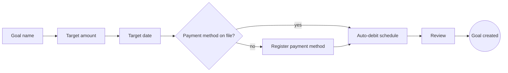

# User Flow: [Flow Name]

> **Status**: Draft | In Review | Approved | Implemented
> **Author**: [Name or agent — e.g., product-designer]
> **Last Updated**: [YYYY-MM-DD]
> **Flow ID**: [kebab-case identifier; the file is `design/ux/<flow-id>.md` — e.g., `goal-create`]
> **Surfaces**: [The subset of `platform.surfaces` this flow runs on — `web` | `ios` | `android`]
> **Journey Stage(s)**: [From `design/product/user-journey.md` — e.g., Onboarding / Activation]
> **Related PRDs**: [e.g., `design/prd/goals.md` § UI Requirements, `design/prd/payments.md`]
> **Screen Specs**: [The `design/ux/<slug>.md` spec of each screen on the critical path — written from `ux-spec.md`]
> **Success Metric**: [The PRD metric this flow moves — e.g., goal-creation completion rate, from `## Success Metrics & Instrumentation`]
> **Accessibility Target**: [The committed `accessibility.target` from `design/accessibility-requirements.md`]
> **Design Source**: [none — markdown spec only | claude-design — <locator> · record `design/handoff/<flow-id>/HANDOFF.md` | figma — <node URL> · record `design/handoff/<flow-id>/HANDOFF.md` — the flow's screens or prototype; the record is written by `/design-handoff`]
> **Open Questions**: [none — or the count; each is written as an "Open:" line in the section it belongs to, with an owner and a date]

> **Note — Scope boundary**: A flow spec maps a multi-screen task from its entry
> points to a defined exit: the path, its branches, the decisions along it and how
> the user recovers when something fails. It does not specify screen layout —
> every screen on the critical path that calls the API has its own spec from
> `ux-spec.md`, and that spec's `## API Data` section is the list `/api-design
> reconcile` and the Validation → Build gate read. Global UI (navigation, banners,
> maintenance and force-update states) lives in `design/ux/app-shell.md`.

---

## Entry Points & Deep Links

> Every way a user can start this flow, and what state they carry in. A flow entered
> from a notification must land on the right step, not on the home screen.

| Entry Point | Surface | Trigger | Route / Link | State Carried In | Auth Required? | Notes |
|-------------|---------|---------|--------------|------------------|----------------|-------|
| [Home primary action] | [web, ios, android] | [Taps "New goal"] | [`/goals/new` · `moa://goals/new`] | [—] | [Yes] | [—] |
| [Goals tab empty state] | [all] | [Taps "Create your first goal"] | [same] | [`entry_point=empty_state`] | [Yes] | [—] |
| [Lifecycle push / 알림톡 button] | [ios, android] | [Opens the message] | [`https://moa.example/goals/new?template=travel`] | [Prefilled template] | [Yes — sign in, then resume at step 1] | [Marketing messages need advertising consent; informational ones do not] |
| [Entry point] | [Surface] | [Trigger] | [Route / link] | [State] | [Yes/No] | [Notes] |

**Signed-out entry**: [What happens when a deep link opens this flow without a session — sign in, then resume at which step with which parameters.]

**Re-entry**: [What happens when the user starts the flow again while a draft or an earlier attempt exists — resume, restart, or ask.]

---

## Critical Path

> The shortest successful route from entry to the success exit. Draw it as a Mermaid
> flowchart so it diffs in review, then describe each step. Operations named here
> must also appear in the `## API Data` section of the step's screen spec.

| Step | Screen (Spec) | User Action | System Response | Operation(s) | Effort Budget |
|------|---------------|-------------|-----------------|--------------|---------------|
| 1 | [Goal name — `design/ux/goal-create-name.md` or "inline"] | [Enters a name or picks a template] | [Validates length; suggests an emoji] | [—] | [≤ 1 input] |
| 2 | [Screen] | [Action] | [Response] | [e.g., `POST /v1/goals` (`createGoal`)] | [Inputs / taps / seconds] |
| [n] | [Review] | [Confirms] | [Creates the goal and the first debit schedule] | [Operations] | [—] |

**Steps the user can skip or defer**: [e.g., the emoji, the goal image — defaults applied.]

**Progress indication**: [How the user knows where they are — step counter, progress bar, or none for three steps or fewer.]

---

## Branches & Optional Paths

| Branch | Taken When | Steps | Rejoins At | Notes |
|--------|------------|-------|------------|-------|
| [Register payment method] | [No payment method on file] | [Toss Payments billing registration → return] | [Step 4 — auto-debit schedule] | [The vendor flow opens outside the app; design the return and cancel states] |
| [Save as draft] | [User leaves before review] | [Draft saved locally and server-side] | [Re-entry resumes at the last completed step] | [—] |
| [Branch] | [Condition] | [Steps] | [Rejoin point] | [Notes] |

---

## Decision Points

> Every place where the flow forks — decided by the user or by the system. For user
> decisions, state what information is on screen when they decide; for system
> decisions, state the rule and where it is defined.

| Decision | Decided By | Options | Default | Information Shown to Decide | Reversible? | Rule Source |
|----------|------------|---------|---------|-----------------------------|-------------|-------------|
| [Debit frequency] | [User] | [Weekly / monthly] | [Monthly] | [Amount per debit and the first debit date] | [Yes — editable later] | [—] |
| [Eligible for auto-debit?] | [System] | [Continue / explain and stop] | [—] | [Why not, and what to do] | [—] | [`design/prd/payments.md` § Business Rules & Calculations] |
| [Decision] | [User / System] | [Options] | [Default] | [Information] | [Yes/No] | [Source] |

---

## Error & Recovery Paths

> Every failure the flow can meet, what the user sees and how they get back on the
> path without losing work. Cover at least: network loss, timeout, validation error,
> session expiry, duplicate submission, server error, and every third-party step
> (payment, identity verification) being cancelled or failing.

| Failure | Step | Detection | What the User Sees | Recovery | Input Preserved? | Event |
|---------|------|-----------|--------------------|----------|------------------|-------|
| [Network lost] | [Any] | [Request fails offline] | [Offline banner; the step stays editable] | [Retry automatically on reconnect] | [Yes] | [—] |
| [Amount below the minimum] | [2] | [Client validation, confirmed by the API] | [Inline error stating the limit] | [Edit the amount] | [Yes] | [`goal_create_validation_failed`] |
| [Payment registration cancelled] | [Branch] | [Vendor redirect returns `cancelled`] | [Back at step 4 with "No payment method yet"] | [Try again or save as draft] | [Yes] | [`billing_registration_cancelled`] |
| [Timeout on create] | [Review] | [No response within the client timeout] | [Pending state, then the result] | [Retry with the same idempotency key — never a second goal] | [Yes] | [—] |
| [Session expired] | [Any] | [401 on refresh] | [Re-authentication sheet] | [Resume at the same step] | [Yes] | [—] |
| [Failure] | [Step] | [Detection] | [User sees] | [Recovery] | [Yes/No] | [Event] |

---

## Exit & Success Criteria

**Success exit**: [The state that means the user got what they came for — e.g., "The goal exists, its first debit is scheduled, and the user lands on the goal detail screen with a confirmation."]

**Other exits**:

| Exit | Where | What Is Kept | What the User Is Told | Follow-up |
|------|-------|--------------|-----------------------|-----------|
| [Cancel] | [Any step] | [Nothing — or a draft] | [Confirmation when input would be lost] | [—] |
| [Abandon] | [Any step] | [Draft] | [—] | [Informational reminder only if the user opted in] |

**Success criteria** (measurable; the product-manager confirms the targets):
- [ ] [Completion rate from `goal_create_started` to `goal_create_completed` ≥ target from the PRD]
- [ ] [Median time to complete ≤ [X] seconds on compact layouts]
- [ ] [Drop-off per step is visible in the funnel defined in `## Analytics Events`]

**Acceptance criteria** (binary, verifiable by a QA engineer):
- [ ] Every entry point in `## Entry Points & Deep Links` lands on the documented step, signed in and signed out
- [ ] The critical path completes on every covered surface with keyboard, pointer, touch and screen reader
- [ ] Every failure in `## Error & Recovery Paths` shows the documented message and recovers without losing input
- [ ] Retrying any write after a timeout never creates a duplicate
- [ ] Each event in `## Analytics Events` fires once with the documented properties

---

## Analytics Events

> Event names follow the `naming.events` convention and the event table in
> `design/product/tracking-plan.md`; new events are proposed there. Properties carry
> IDs and enums — never names, emails, phone numbers or account numbers.

| Event | Step | Trigger | Properties | PII? | Tracking-Plan Status |
|-------|------|---------|------------|------|----------------------|
| [`goal_create_started`] | [Entry] | [First screen shown] | [`entry_point`, `template`] | [No] | [existing / proposed] |
| [`goal_create_step_completed`] | [Each step] | [Step confirmed] | [`step`, `duration_ms`] | [No] | [proposed] |
| [`goal_create_completed`] | [Success exit] | [Goal created] | [`goal_id`, `frequency`, `has_payment_method`] | [No] | [proposed] |
| [Event] | [Step] | [Trigger] | [Properties] | [No/Yes] | [Status] |

**Funnel**: [The ordered events that define this flow's funnel — e.g., `goal_create_started` → `goal_create_step_completed` (step = amount) → … → `goal_create_completed`.]
