# 스킬 흐름도

7단계 파이프라인에서 스킬이 어떤 순서로 이어지는지, 각 스킬이 무엇을 읽고 무엇을 남기는지 그림으로 보여 줍니다.
단계별 설명과 게이트 기준은 [WORKFLOW-GUIDE.md](WORKFLOW-GUIDE.md)에, 단계와 스텝의 원본 정의는
`.claude/docs/workflow-catalog.yaml`에 있습니다. 그림과 카탈로그가 다르면 카탈로그가 맞습니다.

## 그림 읽는 법

| 모양 | 뜻 |
|------|----|
| 사각형 `["/스킬"]` | 스킬 실행 |
| 원통 `[("path")]` | 디스크에 남는 산출물 |
| 마름모 `{"…"}` | 판정 또는 분기 |
| 육각형 `{{"/gate-check …"}}` | 단계 게이트 |
| 점선 화살표 | 선택 스텝이거나 조건부 흐름 |
| 괄호 안의 `standard · full`, `UI`, `백엔드`, `개인정보`, `다국어` | 그 티어나 조건에서만 필수 |

스킬 이름 아래의 대문자 ID(예: `TD-ADR`)는 그 스킬이 호출하는 디렉터 게이트입니다. 리뷰 모드에 따라 건너뛸 수 있습니다
([리뷰 모드](#리뷰-모드와-디렉터-게이트) 참고).

---

## 전체 파이프라인

### 한눈에 보기

```mermaid
flowchart LR
    DIS["1 Discovery<br/>탐색"] -->|"/gate-check definition"| DEF["2 Definition<br/>기획"]
    DEF -->|"/gate-check architecture"| ARC["3 Architecture<br/>아키텍처"]
    ARC -->|"/gate-check validation"| VAL["4 Validation<br/>검증"]
    VAL -->|"/gate-check build"| BLD["5 Build<br/>구축"]
    BLD -->|"/gate-check hardening"| HRD["6 Hardening<br/>안정화"]
    HRD -->|"/gate-check launch"| LCH["7 Launch<br/>출시"]
    LCH -->|"릴리스마다 반복 · 게이트 없음"| LCH
```

`/gate-check`의 인자는 들어가려는 단계입니다. `Launch`는 종착 단계이며, 이후의 릴리스는
`production/releases/<version>/`의 기록 세트로 추적합니다.

### 단계별 핵심 스킬과 산출물

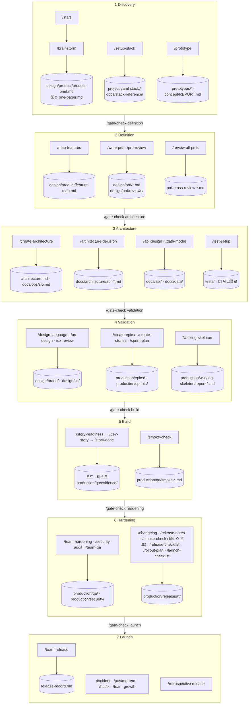

---

## Discovery → Definition

문제를 정리하고, 스택을 고정하고, 제품을 기능과 PRD로 나누는 흐름입니다.

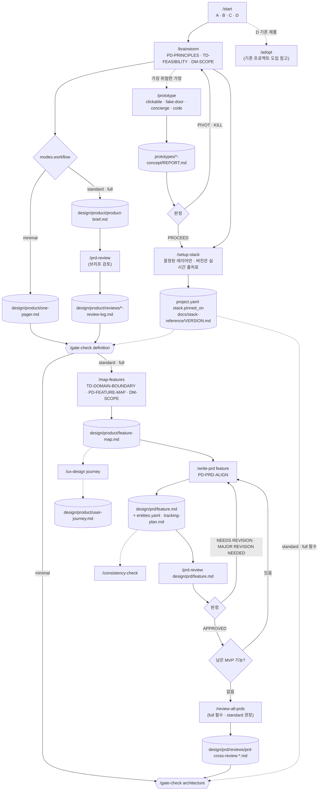

`minimal`에서는 one-pager가 기획 기록이므로 기능 맵과 PRD가 없고, `/gate-check architecture`는 메모와 함께 `PASS`를
돌려줍니다.

### `/write-prd` 한 건의 흐름

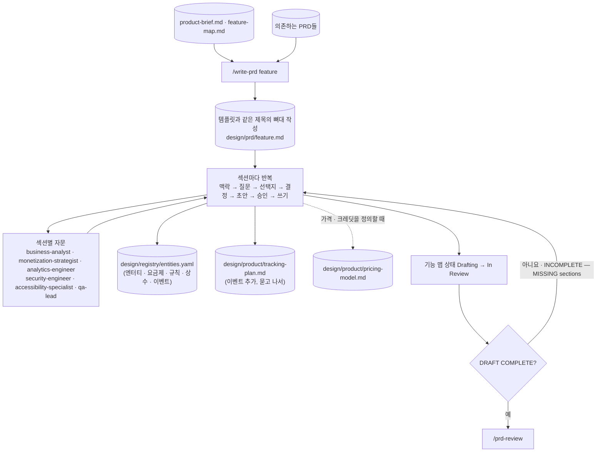

---

## Architecture: API·데이터 계약, 테스트·CI 스캐폴드

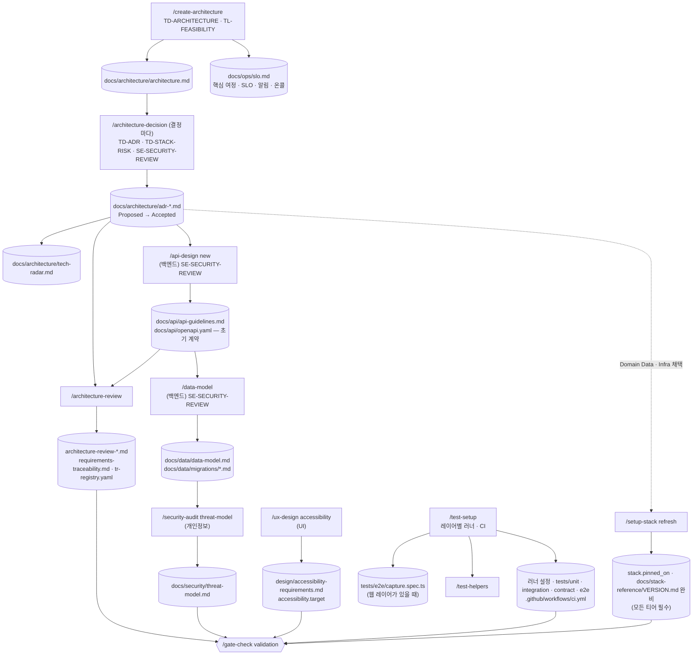

- 이 단계의 `/api-design new`는 인증·세션, 계정, 핵심 도메인 엔터티 같은 Foundation·Core 리소스만 다루는 **초기**
  계약입니다. 화면에 필요한 오퍼레이션은 Validation의 `/api-design reconcile`에서 맞춥니다.
- 테스트 러너와 CI는 Validation 전에 한 번만 세팅합니다. 워킹 스켈레톤이 이 파이프라인으로 배포되기 때문입니다.

---

## Validation: 워킹 스켈레톤까지

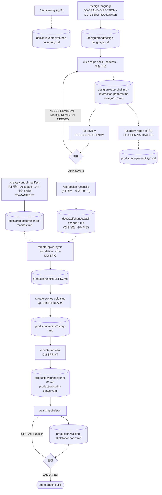

### 워킹 스켈레톤 한 번의 흐름

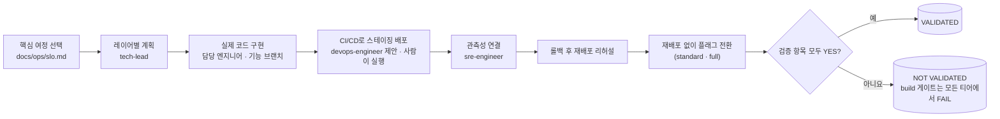

검증 항목은 다섯 가지입니다: CI/CD로 스테이징에 배포, 핵심 여정이 UI → API → DB까지 통과, 헬스 엔드포인트·로그·지표나
트레이스가 관측됨, 롤백 후 재배포 성공, 재배포 없는 플래그 전환(standard·full).

---

## Build: 스토리 루프

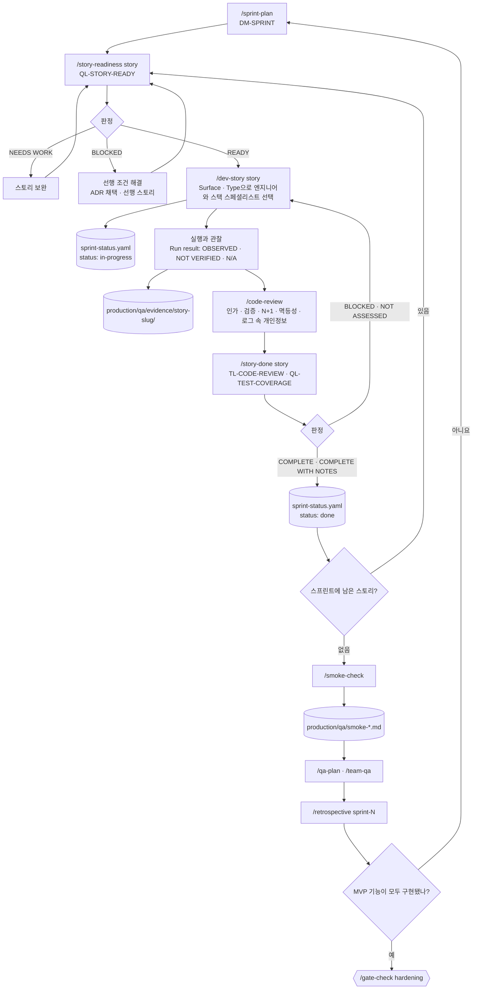

스프린트 중 수시로 쓰는 스킬도 있습니다.

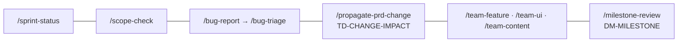

### 스토리 유형과 증거

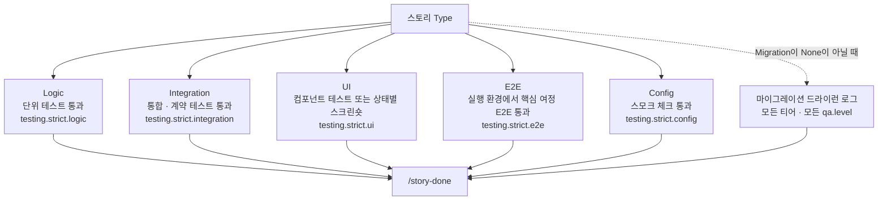

`testing.strict`의 다섯 키(`logic`, `integration`, `ui`, `e2e`, `config`)는 증거가 없을 때 차단할지 경고할지를
유형별로 정합니다. 설정하지 않으면 스킬마다 자기 기본값을 씁니다.

### QA 파이프라인

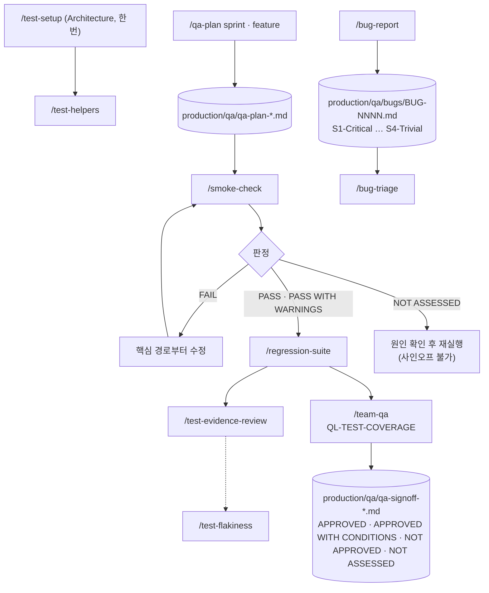

### UX·UI 파이프라인

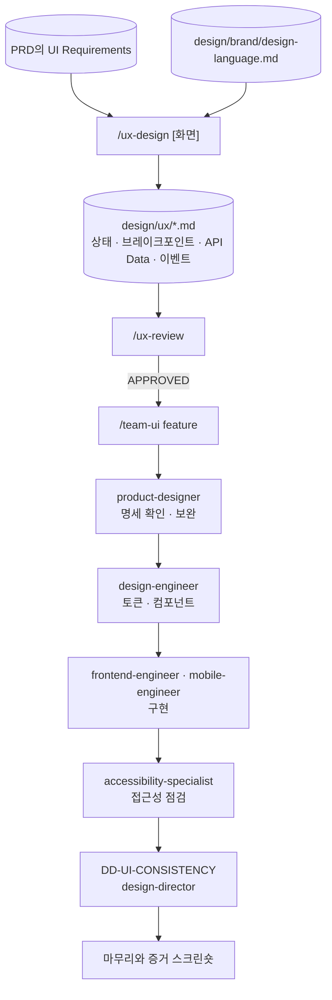

`/team-ui`의 참여 인원은 `team.size`에 따라 달라집니다(위 그림은 `small` 기준). 화면을 새로 만들거나 바꿀 때는 구현
전에 `/ux-design`으로 명세부터 씁니다.

---

## Hardening → Launch

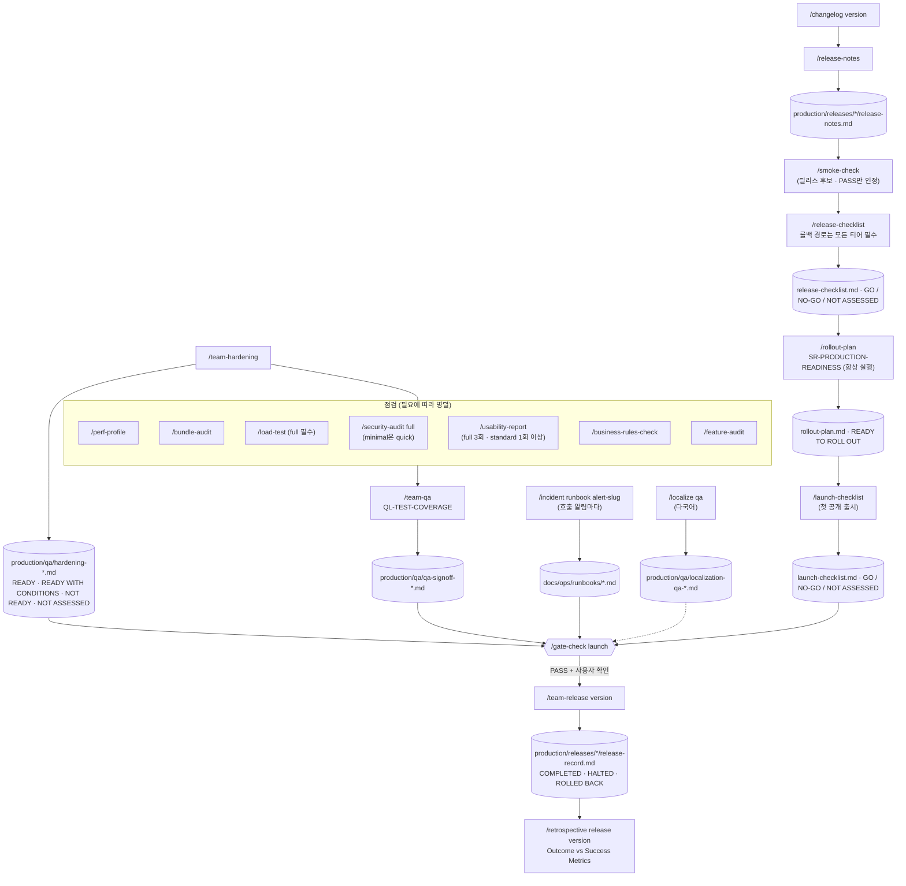

### 롤아웃 한 번의 흐름

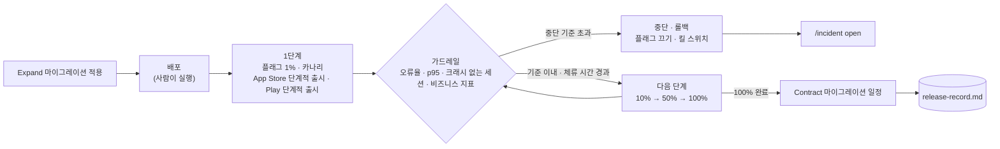

모바일 바이너리는 되돌릴 수 없으므로, 모바일의 롤백 수단은 서버 플래그와 킬 스위치, 그리고 긴급 심사입니다.

---

## 출시 후 반복 전달 루프

Launch는 종착 단계입니다. 이후의 모든 릴리스는 게이트 없이 아래 루프를 돌며 릴리스마다 기록을 남깁니다.

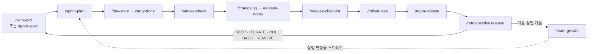

### 그로스 실험 한 건의 흐름

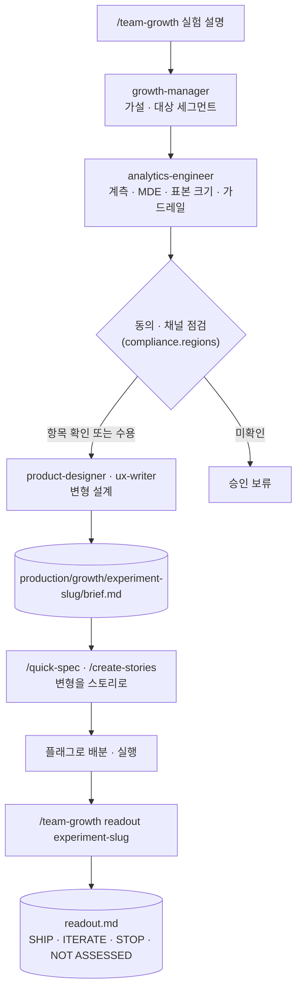

---

## 인시던트 루프

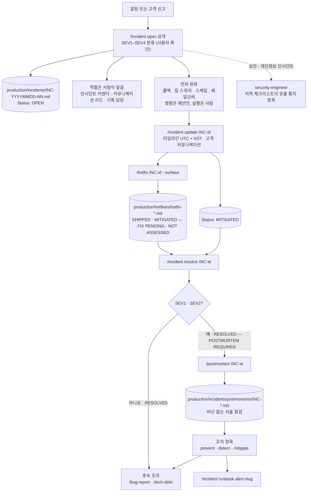

### 핫픽스 경로

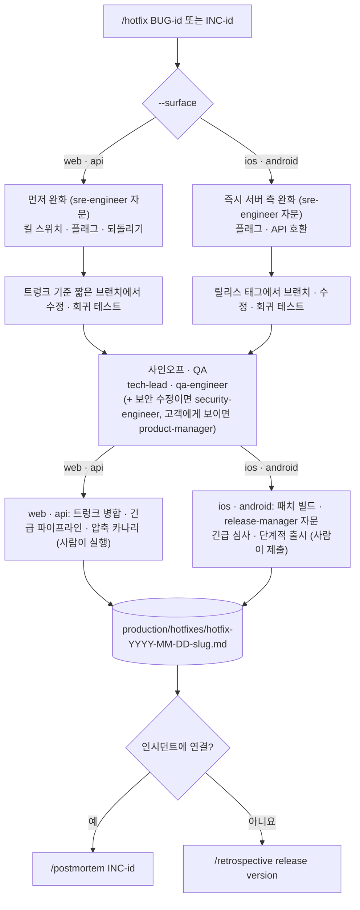

`/incident`, `/hotfix`, `/rollout-plan`은 리뷰 모드와 관계없이 이름 붙은 모든 에이전트와 게이트를 실행하고, 자동화
모드와 관계없이 모든 단계를 승인받습니다.

---

## 기존 프로젝트 도입

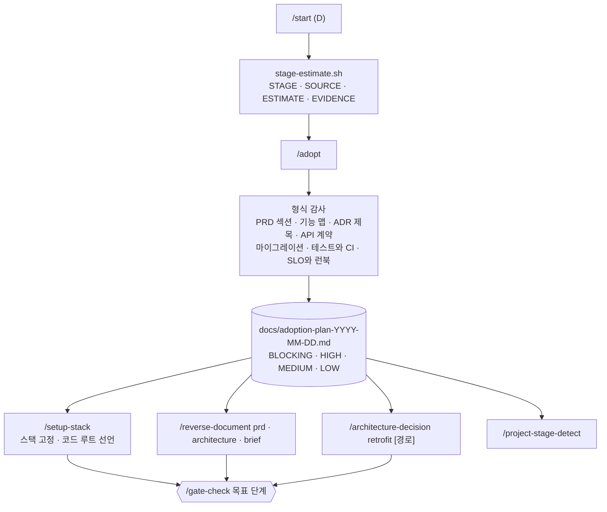

`/adopt`는 기존 작업을 다시 만들지 않고 빈 곳만 채웁니다. `/reverse-document brief`는 기존 제품 브리프를 묻지 않고
덮어쓰지 않습니다.

---

## 리뷰 모드와 디렉터 게이트

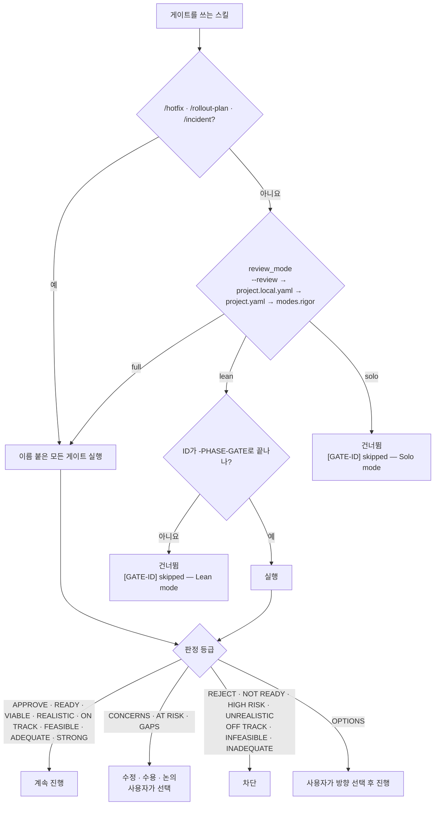

`modes.rigor`를 설정하지 않은 프로젝트는 `minimal`로 해석되어 `review_mode`가 `solo`가 됩니다. `standard`는 `lean`,
`full`은 `full`입니다.

---

## 자주 쓰는 진입점

| 지금 상황 | 실행할 것 |
|-----------|-----------|
| 완전히 처음, 아이디어 없음 | `/start` → `/brainstorm open` |
| 컨셉은 있는데 스택을 안 정함 | `/setup-stack` |
| 컨셉과 스택이 있음 | `/prd-review design/product/product-brief.md` → `/gate-check definition` → `/map-features` (standard·full); minimal이면 `/create-stories` → `/dev-story` |
| 기능 PRD를 쓰는 중 | `/map-features next` 또는 `/write-prd <feature>` |
| MVP PRD가 모두 끝남 | `/review-all-prds` → `/gate-check architecture` |
| 아키텍처 단계 | `/create-architecture` → `/architecture-decision` → `/api-design new` → `/data-model` |
| 테스트 기반 세팅 | `/test-setup` → `/test-helpers` |
| UX 설계 시작 | `/design-language` → `/ux-design shell` → `/ux-design <화면>` |
| Sprint 0 | `/walking-skeleton` → `/gate-check build` |
| 스토리가 있고 개발을 시작 | `/story-readiness <story>` → `/dev-story <story>` |
| 스토리 구현을 마침 | `/story-done <story>` |
| 스프린트 QA | `/qa-plan` → `/smoke-check` → `/regression-suite` |
| 버그가 쌓임 | `/bug-triage` |
| 출시 준비 | `/team-hardening` → `/changelog <version>` → `/release-notes` → `/smoke-check` (릴리스 후보) → `/release-checklist` → `/rollout-plan` → `/launch-checklist` (standard·full, 첫 공개 출시) → `/gate-check launch` |
| 운영 중 장애 | `/incident open "<요약>"` |
| 다음 릴리스 | `/write-prd` → … → `/team-release` → `/retrospective release <version>` |
| 기존 프로젝트 | `/adopt` |
| 모르겠음 | `/help` |
